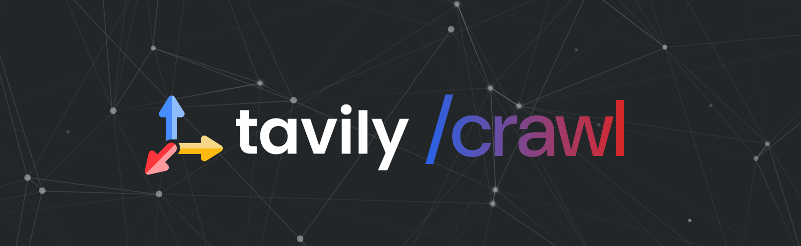

# Tavily Crawl API - Beta Test

<div align="center">
  
</div>

## 👋 Welcome to the Tavily Crawl Beta Test!

We're thrilled to have you join us as we roll out our newest endpoint: **Tavily Crawl**! This powerful API allows you to autonomously follow hyperlinks to discover web pages and extract page content with ease.

> 🚀 **Note:** You're part of an exclusive group testing this API before its public release!


## 🕸️ What is Tavily-Crawl?

The `/crawl` endpoint initiates a structured web crawl starting from a specified base URL. 

Think of Tavily Crawl as a site explorer. You give it a starting point — like a homepage — and it builds a tree of URLs by following links. It mimics the way a human would naturally explore a site, but with powerful controls and built-in filtering.


## 📂 Repository Structure

This repository contains everything you need to get started with Tavily Crawl. We have prepared some notebooks and use cases to inspire ideas. Note: the python SDK is still in the works, so we will make direct HTTP POST requests to Tavily's crawl endpoint.

### [API Documentation](./docs)
A md of Tavily Crawl API:

1. [API Documentation](./docs/crawl_api.md) - Crawl API documentation

### [Cookbooks](./cookbooks)
A series of Jupyter notebooks to help you learn and implement Tavily Crawl:

1. [Getting Started](./cookbooks/getting-started.ipynb) - Your first stop to learn the basics of the Crawl endpoint
2. [RAG with Crawl](./cookbooks/crawl-rag.ipynb) - Learn how to crawl webpages and convert them to vector databases for RAG applications
3. [Agentic Crawling](./cookbooks/agentic-crawl.ipynb) - Advanced techniques for autonomous web crawling

### [Job Search Application](./job_search)
A complete [LangGraph](https://github.com/langchain-ai/langgraph) implementation that combines [Tavily Search](https://docs.tavily.com/docs/tavily-api/search), [Tavily Crawl](https://docs.tavily.com/docs/tavily-api/crawl), and [OpenAI](https://openai.com/) to:
- Find all job postings for a company
- Extract key entities and information
- Create structured data from job listings

Check out the [Job Search README](./job_search/README.md) for a detailed description of this use case and system architecture.


## 🚀 Getting Started

```bash
# Clone this repository
git clone https://github.com/tavily-ai/tavily-crawl-beta-test.git

# Navigate to the repository directory
cd tavily-crawl-beta-test

# Create a virtual environment
python3 -m venv venv

# Activate the virtual environment
source venv/bin/activate  # On Windows: venv\Scripts\activate

# Install dependencies
python3 -m pip install -r requirements.txt
```

A single virtual environment with these dependencies will work for all notebooks and examples in this repository. 

## 📞 Contact Us

Have questions or feedback? We'd love to hear from you!

- Join our dedicated Slack channel for beta testers
- Email our team directly:
  - [Guy Hartstein](mailto:guyh@tavily.com)
  - [Eyal Ben Barouch](mailto:eyal@tavily.com)
  - [Dean Sacoransky](mailto:deansa@tavily.com)

---

<div align="center">
  
  <p>Powered by <a href="https://tavily.com">Tavily</a> - The web API Built for AI Agents</p>
</div>
